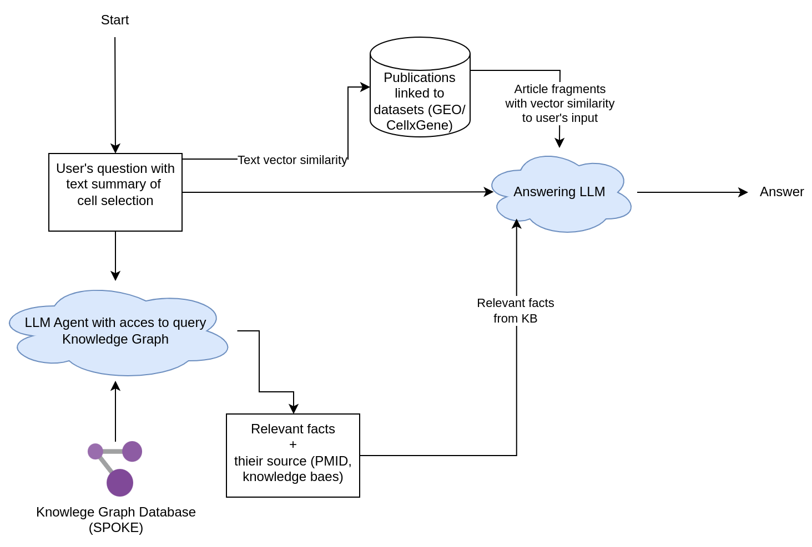

# RNA-seq RAG System


Diagram of the pipeline



## Configuration

Set up environment variables in `.env` file:
```env
OPENAI_API_KEY=<your_openai_api_key>

QDRANT_DATABASE_PATH=databases/qdrant_database.json
QDRANT_COLLECTION_NAME=pubmed_articles
QDRANT_URL=http://localhost:6333
ARTICLE_FILES_DB_PATH=databases/article_database/db.sqlite
ARTICLE_FILES_DIR=databases/article_database/files

# Model Settings
DEFAULT_ANSWERING_MODEL=gpt-4o-mini
SPOKE_MODEL=gpt-4o-mini
DENSE_EMBEDDER_TYPE=fastembed  # Options: fastembed, openai
DENSE_EMBEDDING_MODEL_NAME=sentence-transformers/all-MiniLM-L6-v2  # Model name for the selected embedder type
SPARSE_EMBEDDING_MODEL=Qdrant/bm25

# RAG Pipeline Settings (Optional)
RAG_RESULTS_COUNT=5
RAG_TEMPERATURE=0.2
RAG_MAX_TOKENS=1500

# Document Processing Settings (Optional)
CHUNK_SIZE=512
MIN_DOC_LENGTH=200
MIN_CHUNK_SIZE=10
MIN_CHARACTERS_PER_CHUNK=12

# API Settings
RAG_API_HOST=0.0.0.0
RAG_API_PORT=8000
```

### Using Different Embedding Models

The system supports two types of embedding models:

1. FastEmbed (default):
   - Set `DENSE_EMBEDDER_TYPE=fastembed`
   - Set `DENSE_EMBEDDING_MODEL_NAME` to a FastEmbed model (e.g., "sentence-transformers/all-MiniLM-L6-v2")

2. OpenAI Embeddings:
   - Set `DENSE_EMBEDDER_TYPE=openai`
   - Set `DENSE_EMBEDDING_MODEL_NAME` to one of OpenAI's embedding model names.
   - Make sure your `OPENAI_API_KEY` is valid


## Setup


### Initial setup
Downloads the articles, spins up the docker container with Qdrant vector database and loads article into new Qdrant collection.
This step may take a while depending on the number of articles.
```bash
python scripts/setup.py
```
### Starting service (when you already have article DB and qdrant DB)


```bash
# Starts Qdrant database
python scripts/restart.py

# Start FastAPI service
python src/rna_rag/api/run.py
```

You can download databases from here: [article database](https://mega.nz/file/gxsV1Iqb#YhOatvWv8z_igLDL1WgFNoDO6mO12WwmLhy1OnxFa0U) and [qdrant database](https://mega.nz/file/E41BjIiD#1byyXVRpAkbx0NomAgF7oP1-omZZEIifdkeLFsoP9lE).
Put the content of `databases.zip` into path specified as in `ARTICLE_FILES_DB_PATH`, `ARTICLE_FILES_DIR`, `QDRANT_DATABASE_PATH`.

 Content of `qdrant_data.zip` put in directory that is corresponding to path specified in [qdrant_docker_compose/docker-compose.yml](qdrant_docker_compose/docker-compose.yml) file.


## Using the API

Send queries to RAG module with `POST /query` endpoint


**Request Body:**
```json
{
    "question": "string",     // Required: User's question about the data.
    "data": "string",        // Required: Description of RNA-seq data sample
    "answering_model": "string"  // Optional: Override the default model specified in .env
}
```

**Response:**
```json
{
    "answer": "string"  // The generated answer combining knowledge graph and literature evidence
}
```

Example of use:

```bash
curl -X POST http://localhost:8000/query \
  -H "Content-Type: application/json" \
  -d '{
    "question": "What pathways may be active with such gene expressions in these cells?",
    "data": "3-month-old female mouse bone marrow granulocytopoietic cells, appearing normal. Showing expression of genes like Rab20, Rpl38, and Usp9y."
  }'
```

Check service health:
```bash
curl http://localhost:8000/health
```

Interactive API docs: `http://localhost:8000/docs` 

## Prompt enginnering

If you want to fiddle with the prompts, they are stored in `src/rna_rag/rag/prompts.py`.